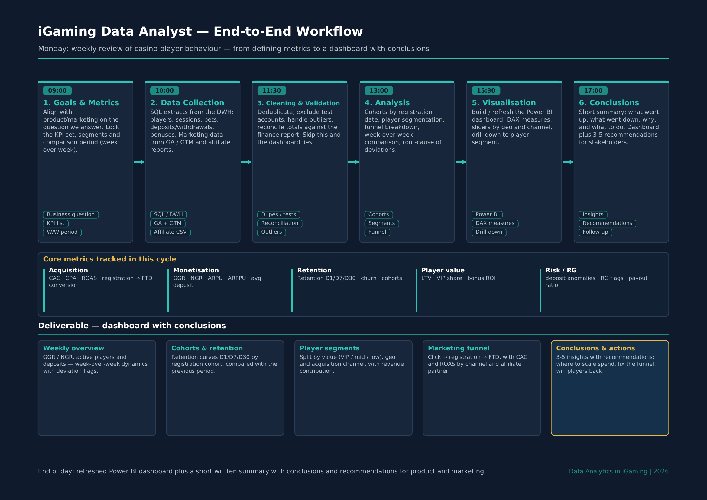

# data-analytics-portfolio

Hi! I'm a SQL Data / Product Analyst with 4+ years of experience, focused on
**iGaming and fintech analytics**.

This repository contains examples of my work in:

- Product analytics
- Funnel and cohort analysis
- KPI design
- Data validation
- Business-focused insights

## Tools

- SQL (PostgreSQL, SQLite, MySQL)
- Power BI (DAX, Power Query)
- Python (Pandas)
- Excel
- Google Sheets

---

## iGaming Data Analyst — End-to-End Workflow

How I approach a weekly player-behaviour review for an online casino / betting product:
from defining the metrics that answer a business question, through data collection and
validation, to a Power BI dashboard with conclusions and recommendations.

📄 [Download as PDF](iGaming_Analyst_Workflow_EN.pdf)

### The process in short

| Step | What happens | Output |
|---|---|---|
| **1. Goals & metrics** | Align with product/marketing on the question being answered; lock the KPI set, segments and comparison period | Defined KPI list, W/W period |
| **2. Data collection** | SQL extracts from the DWH (players, sessions, bets, deposits/withdrawals, bonuses) + marketing data from GA/GTM and affiliate reports | Raw datasets |
| **3. Cleaning & validation** | Deduplication, test-account exclusion, outlier handling, reconciliation against the finance report | Trusted dataset |
| **4. Analysis** | Cohorts by registration date, player segmentation, funnel breakdown, week-over-week comparison, root-cause of deviations | Findings |
| **5. Visualisation** | Build/refresh the Power BI dashboard: DAX measures, geo & channel slicers, drill-down to segment | Dashboard |
| **6. Conclusions** | What went up, what went down, why, and what to do next | Summary + 3–5 recommendations |

### Metrics covered

- **Acquisition** — CAC, CPA, ROAS, registration → FTD conversion
- **Monetisation** — GGR, NGR, ARPU, ARPPU, average deposit
- **Retention** — retention D1/D7/D30, churn, cohort analysis
- **Player value** — LTV, VIP share, bonus ROI
- **Risk / Responsible Gambling** — deposit anomalies, RG flags, payout ratio

---

## Projects

*(my project folders will be here — one line per project with a short description and a link)*

---

## Contact

- LinkedIn: www.linkedin.com/in/serhii-k-51680032a

- Email: sergeykoverzen@gmail.com

> The workflow diagram describes my working methodology. Any dashboard figures shown in
> this repository are illustrative sample data, not real operator data.
