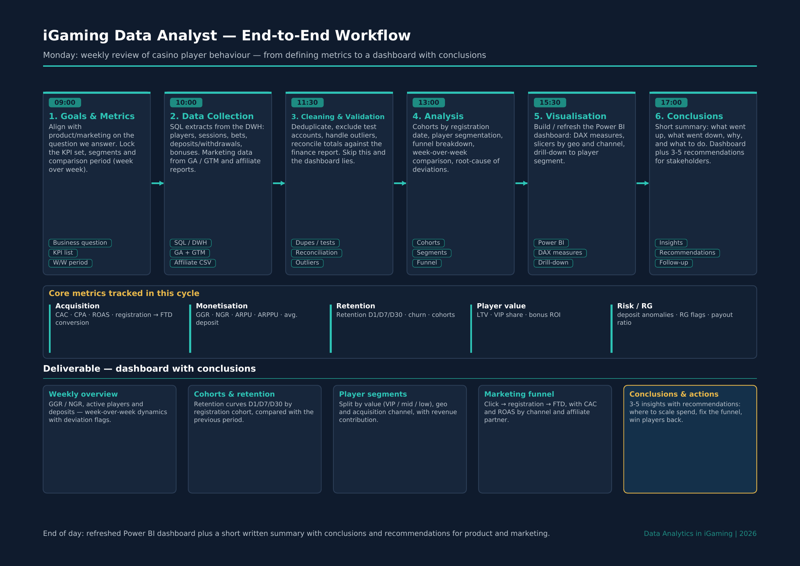

# data-analytics-portfolio

Hi, I'm Sergey Koverzen👋

## Data Analyst → Analytics Engineer

I build end-to-end data pipelines and BI solutions — from raw API/transactional data to clean SQL models and interactive Power BI dashboards.

4+ years of experience in finance and iGaming/betting analytics, where speed and accuracy directly affect revenue. My background in financial accounting 
gives me strong domain knowledge of financial data on top of the technical stack below — currently extending that into analytics engineering: 
data modeling, layered SQL pipelines, and automated ingestion, not just dashboard-building.

## Tech Stack

Data: SQL (PostgreSQL, SQLite, MySQL), Python (Pandas), Excel, Google Sheets

BI: Power BI (DAX, Power Query)

Data Engineering: ETL pipelines, API ingestion, data validation, layered SQL modeling (staging → analytical → BI-ready)

Domains: Finance, iGaming/Betting, Web3/On-chain

---

## This repository contains examples of my work in:

---

## iGaming Data Analyst — End-to-End Workflow

How I approach a weekly player-behaviour review for an online casino / betting product:
from defining the metrics that answer a business question, through data collection and
validation, to a Power BI dashboard with conclusions and recommendations.

📄 [Download as PDF](iGaming_Analyst_Workflow_EN.pdf)

### The process in short

Each step has its own page with a detailed diagram and notes — see the **Details** column.

| Step | What happens | Output | Details |
|---|---|---|---|
| **1. Goals & metrics** | Align with product/marketing on the question being answered; lock the KPI set, segments and comparison period | Defined KPI list, W/W period | [Open →](docs/01-goals-and-metrics.md) |
| **2. Data collection** | SQL extracts from the DWH (players, sessions, bets, deposits/withdrawals, bonuses) + marketing data from GA/GTM and affiliate reports | Raw datasets | [Open →](docs/02-data-collection.md) |
| **3. Cleaning & validation** | Deduplication, test-account exclusion, outlier handling, reconciliation against the finance report | Trusted dataset | [Open →](docs/03-cleaning-and-validation.md) |
| **4. Analysis** | Cohorts by registration date, player segmentation, funnel breakdown, week-over-week comparison, root-cause of deviations | Findings | [Open →](docs/04-analysis.md) |
| **5. Visualisation** | Build/refresh the Power BI dashboard: DAX measures, geo & channel slicers, drill-down to segment | Dashboard | [Open →](docs/05-visualisation.md) |
| **6. Conclusions** | What went up, what went down, why, and what to do next | Summary + 3–5 recommendations | [Open →](docs/06-conclusions.md) |

### Metrics covered

- **Acquisition** — CAC, CPA, ROAS, registration → FTD conversion
- **Monetisation** — GGR, NGR, ARPU, ARPPU, average deposit
- **Retention** — retention D1/D7/D30, churn, cohort analysis
- **Player value** — LTV, VIP share, bonus ROI
- **Risk / Responsible Gambling** — deposit anomalies, RG flags, payout ratio

---

## Projects and On-Chain Analytics Portfolio

---

## 1. DEX Trading Analytics from 01.09.2026

DEX Trading Analytics: Trader Behavior & Volume Concentration

On-chain analysis of 500 DEX trader addresses (Ethereum, 90-day window), exploring trading frequency, volume concentration, and cohort retention patterns in raw blockchain transaction data.

Pipeline: Dune Analytics (SQL) → PostgreSQL (staging table + SQL views) → Power BI (3-page dashboard)

📄 [Download PROJECT №1 "DEX Analytics Build Process" as PDF](docs/DEX_Analytics_Build_Process_01092026.pdf)

📄 [Download PROJECT №1 "Dashboard of Trader Behavior"as PDF](docs/Top_Trades.pdf)

---

## 2. Ethereum Staking Behavior Analysis from 02.09.2026

On-chain analysis of 500 Ethereum staking addresses (Lido, 90-day window), exploring what drives long-term staker engagement beyond simple deposit size.

Pipeline: Dune Analytics (SQL) → PostgreSQL (staging table + SQL views) → Power BI (5-page dashboard)

📄 [Download PROJECT №2 "Ethereum Staking Behavior Build Process" as PDF](docs/Ethereum_Staking_Behavior_Analysis_Build_Process.pdf)

📄 [Download PROJECT №2 "Dashboard Ethereum Staking Behavior Analysis"as PDF](docs/Ethereum_Staking_Behavior_Analysis.pdf)

---

## 3. Financial BI Analysis — Apple, Microsoft & Amazon from 01.10.2026

Real public financial data (SEC EDGAR / XBRL) → Python → PostgreSQL → layered SQL analytical views → Power BI.

A 2-page interactive dashboard (Financial Overview + Company Deep Dive) comparing revenue, profitability, margins, cash flow and balance sheet trends 
across three public companies — built around a deliberate staging → wide → KPI → BI-ready SQL layering, not a single flat query.

Stack: SEC EDGAR API · Python · PostgreSQL · SQL · Power BI

[View Financial BI Analysis Project → ](github.com/SergeyKoverzen/financial-bi-analysis)

---

(My other projects will appear here soon.)

---

## Contact

- LinkedIn: www.linkedin.com/in/serhii-k-51680032a

- Twitter: www.x.com/koverzen

- Email: sergeykoverzen@gmail.com

> The workflow diagram describes my working methodology. Any dashboard figures shown in
> this repository are illustrative sample data, not real operator data.
