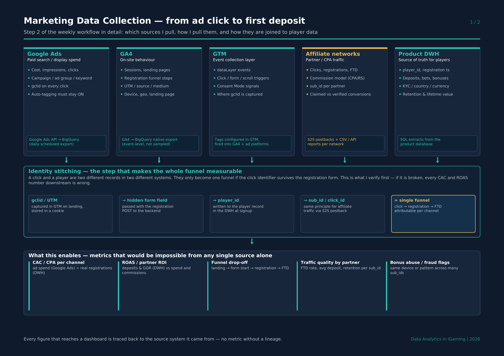
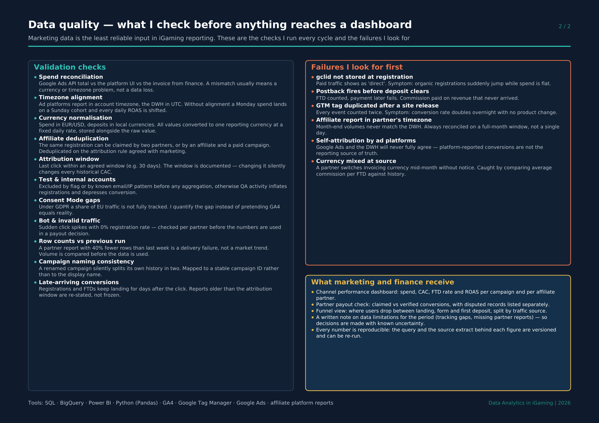

[← Back to portfolio](../README.md) · [← Previous](01-goals-and-metrics.md) · Step 2 of 6 · [Next: Cleaning & Validation →](03-cleaning-and-validation.md)

# 2. Data Collection — from ad click to first deposit

Which marketing sources I pull (Google Ads, GA4, Google Tag Manager, affiliate
networks), how they are collected, and how they are joined to player data so that
CAC, ROAS and funnel metrics can actually be trusted.



## Why this step decides everything downstream

A click and a player are two separate records in two separate systems. They only
become one measurable funnel if the click identifier survives the registration form:

```
gclid / UTM  →  captured in GTM, stored in a cookie
             →  passed as a hidden field with the registration POST
             →  written to the player record in the DWH
             =  click → registration → FTD, attributable per channel
```

The same principle applies to affiliate traffic via `sub_id` and S2S postbacks.
If this chain is broken, paid traffic shows up as "direct" and every CAC and ROAS
figure downstream is wrong — which is the first thing I verify in any new setup.

## Sources and how they are pulled

| Source | What it provides | How it's collected |
|---|---|---|
| **Google Ads** | Spend, impressions, clicks, campaign structure, `gclid` | Google Ads API → BigQuery, scheduled daily |
| **GA4** | Sessions, landing pages, registration funnel steps, UTM parameters | Native GA4 → BigQuery export (event-level, unsampled) |
| **GTM** | dataLayer events, form/click triggers, Consent Mode signals | Tags configured in GTM, fired into GA4 and ad platforms |
| **Affiliate networks** | Clicks, registrations, FTDs, commission model, `sub_id` | S2S postbacks plus CSV/API reports per network |
| **Product DWH** | `player_id`, deposits, bets, bonuses, KYC, retention | SQL extracts from the product database |

## Data quality — checks and known failure modes



Checks run every cycle: spend reconciliation against finance · timezone alignment
(account TZ vs UTC) · currency normalisation · affiliate deduplication · documented
attribution window · test-account exclusion · Consent Mode gap quantification ·
bot / invalid traffic · row-count comparison vs previous run · stable campaign IDs ·
re-statement of late-arriving conversions.

## What this enables

CAC and CPA per channel · ROAS and partner ROI · funnel drop-off between landing,
form and first deposit · traffic quality per affiliate partner · bonus abuse and
fraud flags.

📄 [Download this section as PDF](iGaming_Marketing_Data_Pipeline_EN.pdf)

---

[← Back to portfolio](../README.md) · [Next: Cleaning & Validation →](03-cleaning-and-validation.md)
