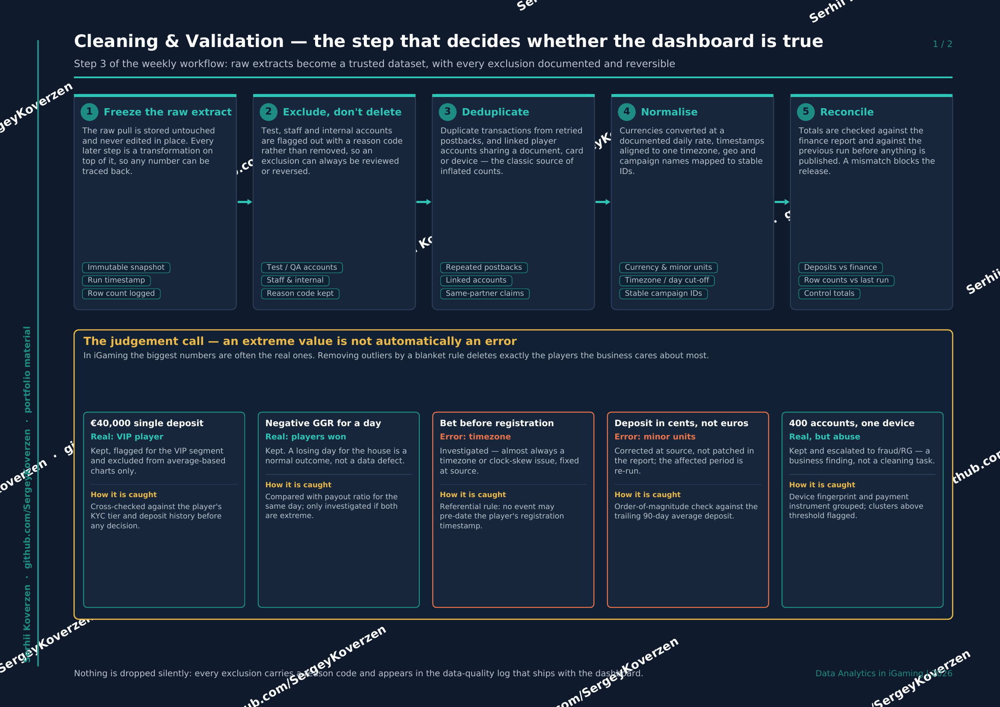
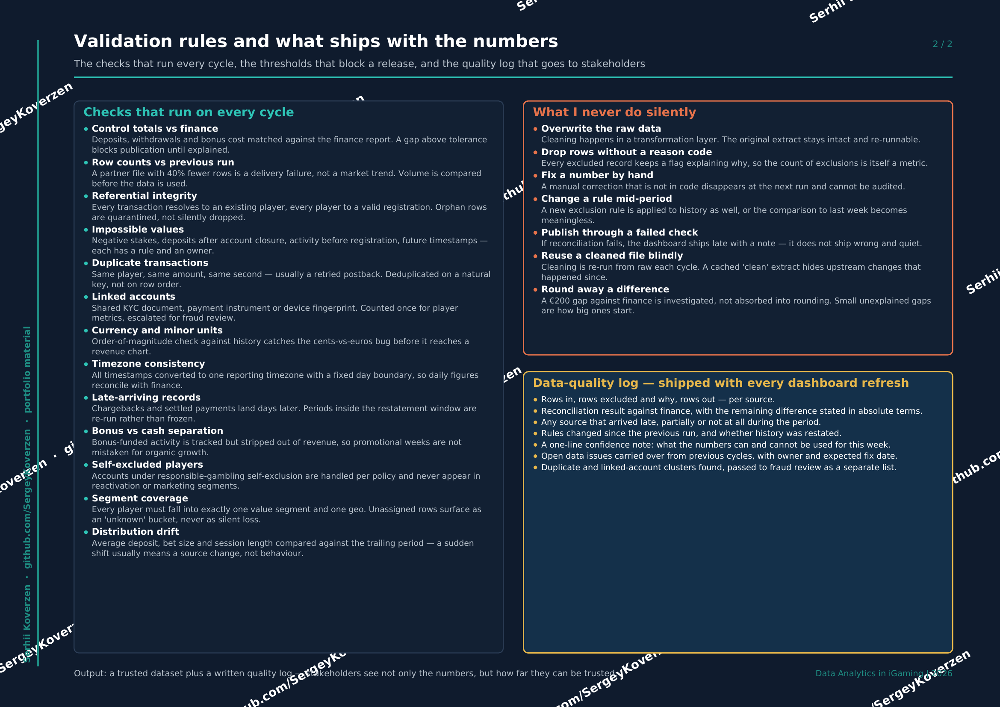

[← Back to portfolio](../README.md) · [← Previous: Data Collection](03-cleaning-and-validation.md) · Step 3 of 6 · [Next: Analysis →](04-analysis.md)

# 3. Cleaning & Validation

Raw extracts become a **trusted dataset**. Every exclusion is documented, reversible, and
reported — because a dashboard built on unvalidated data is worse than no dashboard at all.

## The five stages

1. **Freeze the raw extract** — the raw pull is stored untouched and never edited in place. Every later step is a transformation on top of it, so any number can be traced back to source.
2. **Exclude, don't delete** — test, staff and internal accounts are flagged out with a reason code rather than removed, so an exclusion can always be reviewed or reversed.
3. **Deduplicate** — repeated transactions from retried postbacks, and linked player accounts sharing a document, card or device.
4. **Normalise** — currencies at a documented daily rate, timestamps to one timezone, geo and campaign names mapped to stable IDs.
5. **Reconcile** — totals checked against the finance report and the previous run. A mismatch blocks the release.

## An extreme value is not automatically an error

In iGaming the biggest numbers are often the real ones. Removing outliers by a blanket
rule deletes exactly the players the business cares about most.

| Observation | Verdict | What I do |
|---|---|---|
| €40,000 single deposit | Real — VIP player | Kept, flagged for the VIP segment, excluded from average-based charts only |
| Negative GGR for a day | Real — players won | Kept. A losing day for the house is a normal outcome, not a defect |
| Bet before registration | Error — timezone | Investigated; almost always clock skew, fixed at source |
| Deposit in cents, not euros | Error — minor units | Corrected at source and the affected period re-run, never patched in the report |
| 400 accounts, one device | Real, but abuse | Kept and escalated to fraud/RG — a business finding, not a cleaning task |

## Validation rules and what ships with the numbers

Checks that run every cycle: control totals vs finance · row counts vs previous run ·
referential integrity · impossible values · duplicate transactions · linked accounts ·
currency and minor units · timezone consistency · late-arriving records · bonus vs cash
separation · self-excluded players · segment coverage · distribution drift.

### What I never do silently

- Overwrite the raw data — cleaning happens in a transformation layer
- Drop rows without a reason code — the count of exclusions is itself a metric
- Fix a number by hand — a manual correction that isn't in code cannot be audited
- Change a rule mid-period without restating history
- Publish through a failed check — the dashboard ships late with a note, not wrong and quiet

## Output of this step

A trusted dataset **plus a written data-quality log** that ships with every refresh:
rows in / excluded / out per source, the reconciliation result against finance with any
remaining difference stated in absolute terms, sources that arrived late or incomplete,
rules changed since the previous run, and a one-line confidence note on what the numbers
can and cannot be used for this week.

Stakeholders see not only the numbers, but how far they can be trusted.

📄 [Download this section as PDF](iGaming_Cleaning_and_Validation_EN.pdf)

---

[← Back to portfolio](../README.md) · [← Previous: Data Collection](03-cleaning-and-validation.md) · Step 3 of 6 · [Next: Analysis →](04-analysis.md)
