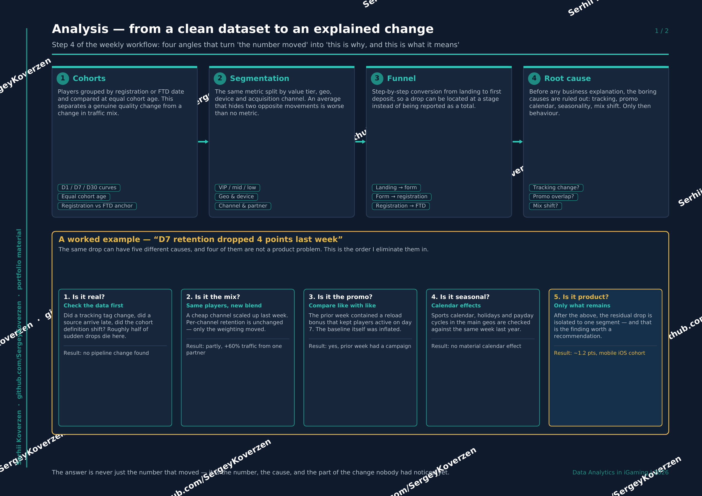
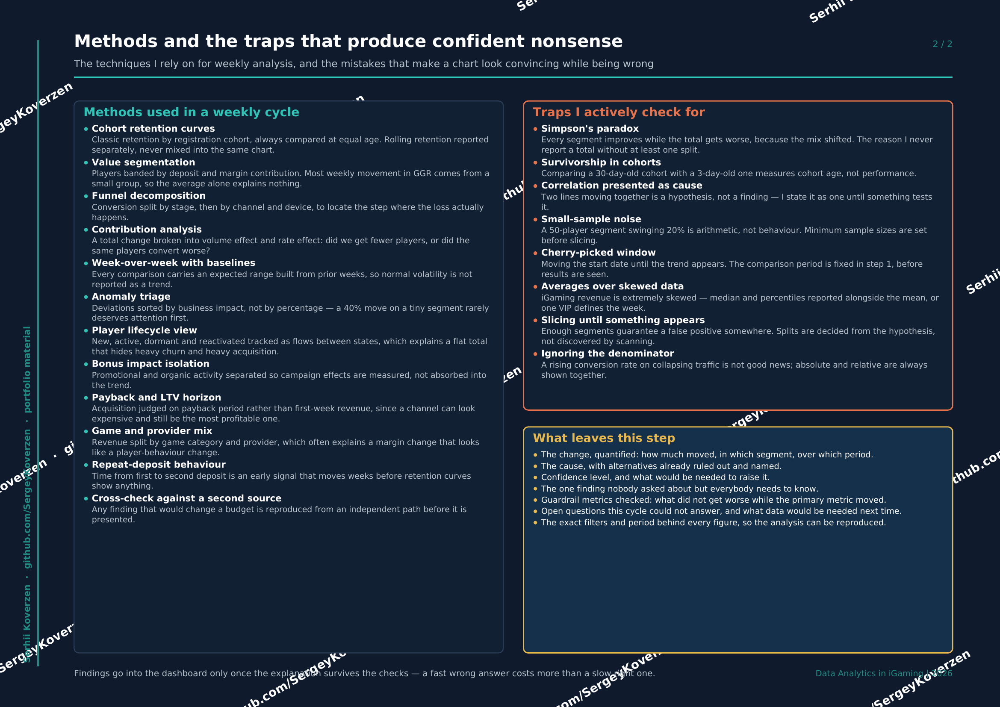

[← Back to portfolio](../README.md) · [← Previous: Cleaning & Validation](03-cleaning-and-validation.md) · Step 4 of 6 · [Next: Visualisation →](05-visualisation.md)

# 4. Analysis

Turning a clean dataset into an **explained** change: not just what moved, but why it
moved, and which part of it nobody had noticed yet.

## Four angles

1. **Cohorts** — players grouped by registration or FTD date and compared at equal cohort age. This separates a genuine quality change from a change in traffic mix.
2. **Segmentation** — the same metric split by value tier, geo, device and channel. An average that hides two opposite movements is worse than no metric.
3. **Funnel** — step-by-step conversion from landing to first deposit, so a drop can be located at a stage rather than reported as a total.
4. **Root cause** — the boring causes get ruled out before any business explanation: tracking, promo calendar, seasonality, mix shift. Only then behaviour.

## A worked example: "D7 retention dropped 4 points last week"

The same drop can have five different causes — and four of them are not a product problem.
This is the order I eliminate them in:

| # | Question | What I check | Typical outcome |
|---|---|---|---|
| 1 | Is it real? | Tracking tag changes, late-arriving sources, cohort definition shifts | Roughly half of sudden drops die here |
| 2 | Is it the mix? | Per-channel retention vs channel weighting | Per-channel unchanged; a cheap channel simply scaled up |
| 3 | Is it the promo? | Promo calendar overlap on the baseline week | Prior week contained a reload bonus — the baseline was inflated |
| 4 | Is it seasonal? | Sports calendar, holidays, payday cycles vs same week last year | Often no material effect |
| 5 | Is it product? | Whatever residual remains, isolated to a segment | ~1.2 pts, mobile iOS cohort — **this** is the finding |

The first four steps are not overhead. They are what stops a team from rebuilding a
feature because a marketing campaign ended.

## Methods and traps

**Methods used in a weekly cycle:** cohort retention curves · value segmentation ·
funnel decomposition · contribution analysis (volume effect vs rate effect) ·
week-over-week with expected ranges · anomaly triage by business impact ·
player lifecycle flows · bonus impact isolation · payback and LTV horizon ·
game and provider mix · repeat-deposit behaviour.

**Traps I actively check for:**

- **Simpson's paradox** — every segment improves while the total worsens because the mix shifted. The reason I never report a total without at least one split.
- **Survivorship in cohorts** — comparing a 30-day-old cohort with a 3-day-old one measures cohort age, not performance.
- **Correlation presented as cause** — two lines moving together is a hypothesis, and I label it as one.
- **Small-sample noise** — a 50-player segment swinging 20% is arithmetic, not behaviour.
- **Cherry-picked window** — the comparison period is fixed in step 1, before any results are seen.
- **Averages over skewed data** — iGaming revenue is extremely skewed; median and percentiles go alongside the mean, or one VIP defines the week.

## What leaves this step

The change quantified (how much, which segment, which period) · the cause, with
alternatives already ruled out and named · confidence level and what would raise it ·
guardrail metrics that did not get worse · open questions for the next cycle · and the
exact filters behind every figure, so the analysis can be reproduced.

📄 [Download this section as PDF](iGaming_Analysis_EN.pdf)

---

[← Back to portfolio](../README.md) · [← Previous: Cleaning & Validation](03-cleaning-and-validation.md) · Step 4 of 6 · [Next: Visualisation →](05-visualisation.md)
