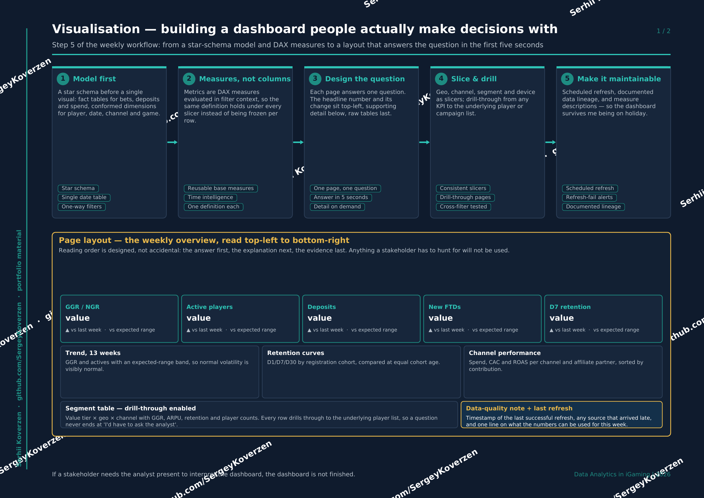
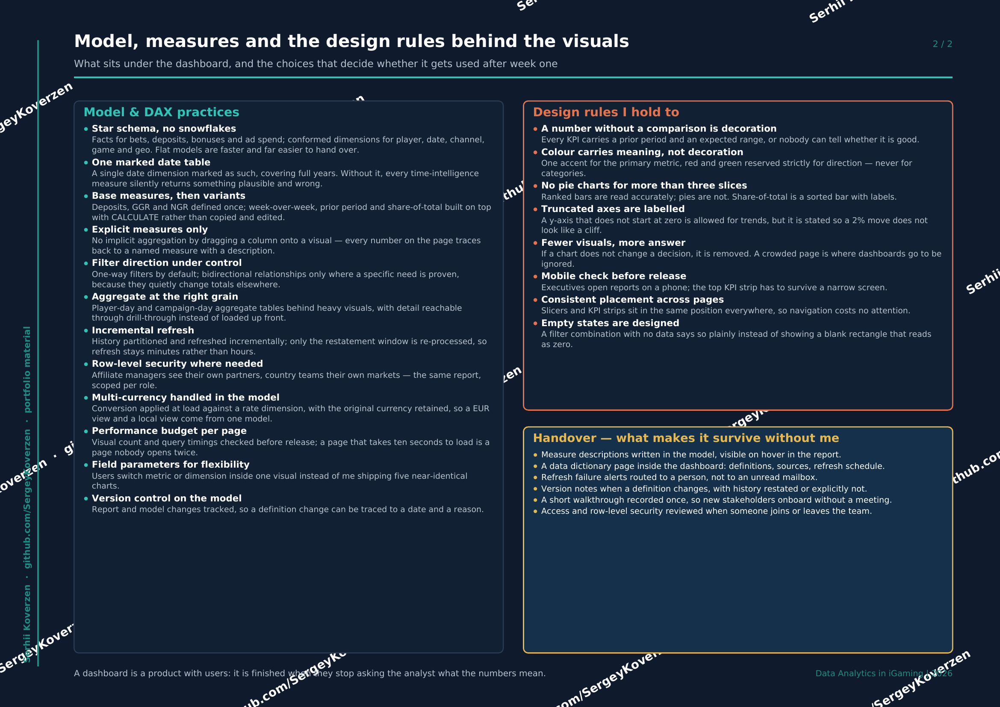

[← Back to portfolio](../README.md) · [← Previous: Analysis](04-analysis.md) · Step 5 of 6 · [Next: Conclusions →](06-conclusions.md)

# 5. Visualisation

Building a dashboard people actually make decisions with — from a star-schema model and
DAX measures to a layout that answers the question in the first five seconds.

## The five stages

1. **Model first** — a star schema before a single visual: fact tables for bets, deposits, bonuses and ad spend; conformed dimensions for player, date, channel, game and geo.
2. **Measures, not columns** — metrics are DAX measures evaluated in filter context, so one definition holds under every slicer instead of being frozen per row.
3. **Design the question** — each page answers one question. Headline number and its change top-left, supporting detail below, raw tables last.
4. **Slice & drill** — consistent slicers for geo, channel, segment and device; drill-through from any KPI to the underlying player or campaign list.
5. **Make it maintainable** — scheduled refresh, documented lineage, measure descriptions, refresh-failure alerts.

## Page layout

Reading order is designed, not accidental: **the answer first, the explanation next, the
evidence last.** Anything a stakeholder has to hunt for will not be used.

| Zone | Content |
|---|---|
| KPI strip (top) | GGR/NGR, active players, deposits, new FTDs, D7 retention — each with prior period and expected range |
| Charts (middle) | 13-week trend with expected-range band · retention curves by cohort · channel performance with CAC and ROAS |
| Detail (bottom left) | Segment table (value tier × geo × channel), drill-through to the underlying player list |
| Quality note (bottom right) | Last successful refresh, sources that arrived late, one line on what the numbers can be used for |

## Model, measures and design rules

**Model & DAX practices:** star schema without snowflakes · one marked date table ·
base measures then variants built with `CALCULATE` · explicit measures only (no implicit
aggregation) · one-way filter direction by default · aggregate tables at player-day and
campaign-day grain · incremental refresh with a restatement window · row-level security
per role · multi-currency handled in the model · performance budget per page ·
field parameters instead of five near-identical charts · version control on the model.

**Design rules I hold to:**

- A number without a comparison is decoration — every KPI carries a prior period and an expected range
- Colour carries meaning, not decoration — red and green reserved strictly for direction, never for categories
- No pie charts beyond three slices — ranked bars are read accurately, pies are not
- Truncated axes are labelled, so a 2% move does not look like a cliff
- Fewer visuals, more answer — if a chart does not change a decision, it is removed
- Mobile check before release — executives open reports on a phone
- Empty states are designed — "no data for this filter" instead of a blank rectangle that reads as zero

## Handover — what makes it survive without me

Measure descriptions written into the model and visible on hover · a data-dictionary page
inside the dashboard (definitions, sources, refresh schedule) · refresh-failure alerts
routed to a person rather than an unread mailbox · version notes when a definition changes,
stating whether history was restated · a short recorded walkthrough so new stakeholders
onboard without a meeting.

> A dashboard is a product with users. It is finished when they stop asking the analyst
> what the numbers mean.

📄 [Download this section as PDF](iGaming_Visualisation_EN.pdf)

---

[← Back to portfolio](../README.md) · [← Previous: Analysis](04-analysis.md) · Step 5 of 6 · [Next: Conclusions →](06-conclusions.md)
