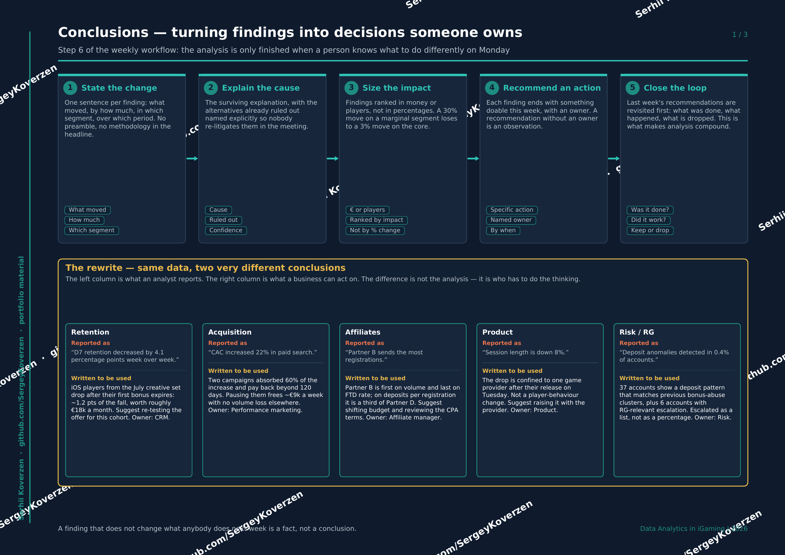
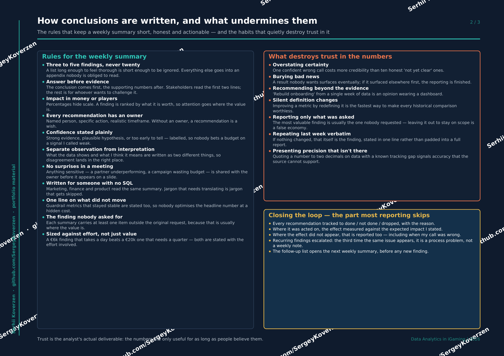
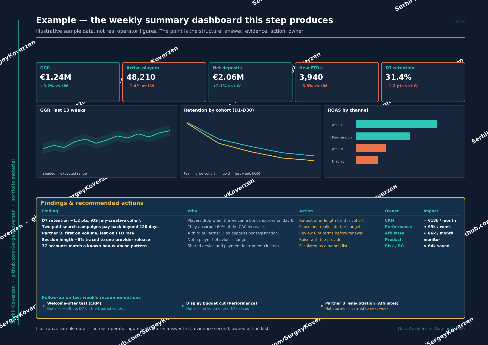

[← Back to portfolio](../README.md) · Step 6 of 6 · [Back to step 1 →](01-goals-and-metrics.md)

# 6. Conclusions

The analysis is only finished when a person knows what to do differently on Monday.
This step turns findings into decisions someone owns.

## The five stages

1. **State the change** — one sentence per finding: what moved, by how much, in which segment, over which period.
2. **Explain the cause** — the surviving explanation, with the ruled-out alternatives named so nobody re-litigates them in the meeting.
3. **Size the impact** — findings ranked in money or players, not percentages. A 30% move on a marginal segment loses to a 3% move on the core.
4. **Recommend an action** — something doable this week, with a named owner. A recommendation without an owner is an observation.
5. **Close the loop** — last week's recommendations are revisited first. This is what makes analysis compound instead of repeating.

## The rewrite — same data, two very different conclusions

The difference between these columns is not the analysis. It is who has to do the thinking.

| Reported as | Written to be used |
|---|---|
| "D7 retention decreased by 4.1 percentage points week over week." | iOS players from the July creative set drop after their first bonus expires: ~1.2 pts of the fall, worth roughly €18k a month. Re-test the offer for this cohort. **Owner: CRM.** |
| "CAC increased 22% in paid search." | Two campaigns absorbed 60% of the increase and pay back beyond 120 days. Pausing them frees ~€9k a week with no volume loss elsewhere. **Owner: Performance marketing.** |
| "Partner B sends the most registrations." | Partner B is first on volume and last on FTD rate — a third of Partner D on deposits per registration. Review the CPA terms. **Owner: Affiliate manager.** |
| "Session length is down 8%." | The drop is confined to one game provider after their Tuesday release. Not a player-behaviour change. Raise it with the provider. **Owner: Product.** |

## How conclusions are written

**Rules for the weekly summary:** three to five findings, never twenty · answer before
evidence · impact in money or players · every recommendation has an owner · confidence
stated plainly · observation separated from interpretation · no surprises in a meeting ·
written for someone with no SQL · one line on what did *not* move · at least one finding
nobody asked for · sized against effort, not just value.

**What destroys trust:** overstating certainty · burying bad news · recommending beyond
the evidence · silent definition changes · reporting only what was asked · repeating last
week verbatim · presenting precision the source cannot support.

## Example: the weekly summary this step produces

> **Illustrative sample data — no real operator figures.** The point is the structure:
> KPI strip with comparisons, supporting evidence, then findings with an owner and a sized
> impact, and last week's follow-up closing the loop.

## Closing the loop

Every recommendation is tracked to done / not done / dropped, with the reason. Where it was
acted on, the effect is measured against the impact I stated — **including when my call was
wrong.** Recurring findings get escalated: the third time the same issue appears, it is a
process problem, not a weekly note. The follow-up list opens the next summary, before any
new finding.

> Trust is the analyst's actual deliverable. The numbers are only useful for as long as
> people believe them.

📄 [Download this section as PDF](iGaming_Conclusions_EN.pdf)

---

[← Back to portfolio](../README.md) · [Back to step 1 →](01-goals-and-metrics.md)
